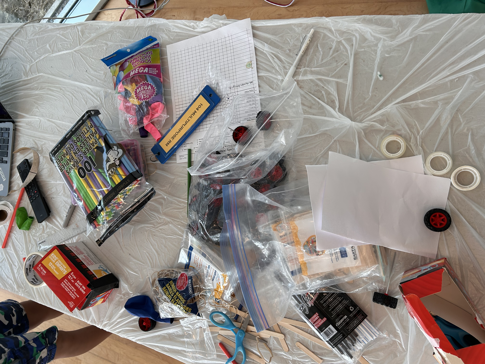

## Introduction

This is an engaging and educational activity that gives students an opportunity to learn about physics, and then use their creativity and engineering skills to build a car. We found that students were engaged with both the lesson and the activity. Two hours is a good amount of time for this activity, although it is flexible.

The setup for this activity was easy compared to other experiments.

## Materials

- Balloons
- Plastic wheels with metal axels
- Popsicle sticks
- Foam board/cardboard
- Paper straws
- Elastic bands
- Tape
- Hot glue gun
- Scissors

Here is a picture of the materials we used for this activity:

## Lesson

Topics covered in the presentation include using Newton’s 3 laws to explain how the car works, and explaining force vs energy.

Below is the presentation we made for this lesson. You may not use this presentation for commercial purposes.

<iframe src="https://docs.google.com/presentation/d/e/2PACX-1vRJCpS2On9oWIGqs5qzPd7Ew35QGo3TOmIu1C1gTZlbOaav9GnTuZFr8eyHygF_nw/pubembed?start=false&loop=true&delayms=3000" frameborder="0" width="1920" height="1109" allowfullscreen="true" mozallowfullscreen="true" webkitallowfullscreen="true"></iframe>

## Activity 

We found several reference photos online that could help students come up with ideas on how to make their balloon-powered car. However, we did not give students any tutorial and instead presented them with the materials that they could use as they wished.

Students took about 45 minutes to 1 hour to finish the car. Then, all the cars were lined up and the students put their cars in a test in a race. The best car travelled around 3 metres.

After the race, we had the students play the following Jeopardy, which we made beforehand:

<iframe src="https://jeopardylabs.com/play/labrats-day-4?embed=1" frameborder="0" width="100%" height="500"></iframe><a target="_blank" href="https://jeopardylabs.com" style="color:#8791de; font-size:12px;">JeopardyLabs</a>

